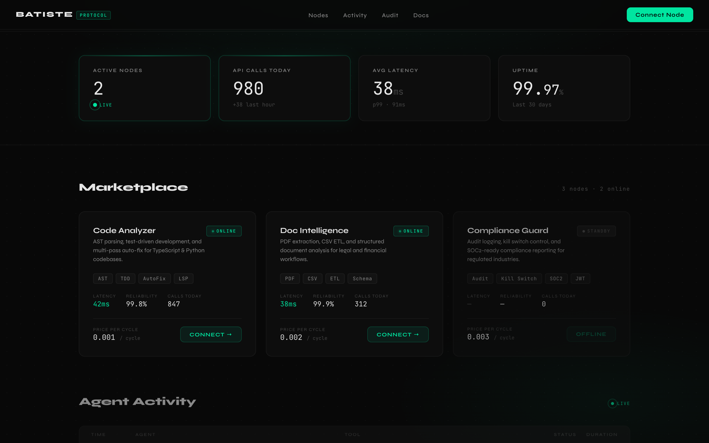
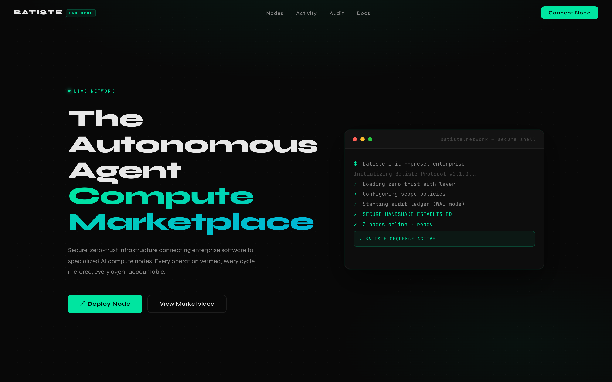
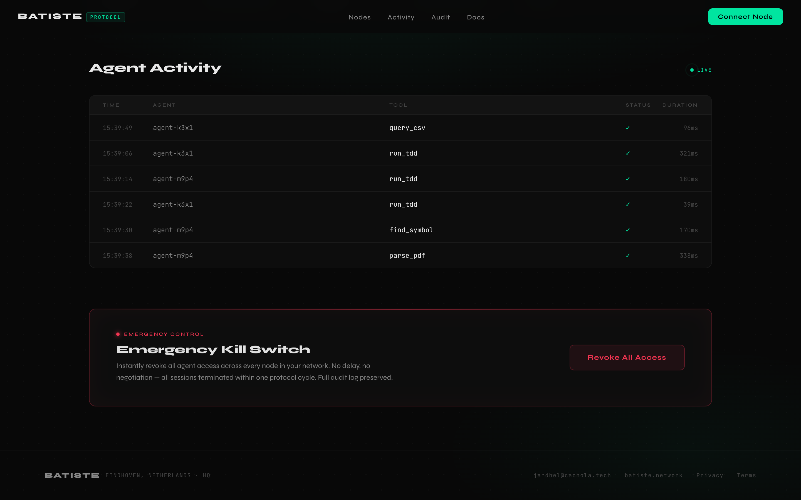

<div align="center">

# BATISTE

### The Autonomous Agent Compute Marketplace

[](./LICENSE)
[](https://nodejs.org)
[](https://pnpm.io)
[](#)
[](#)
[](https://github.com/jardhel/batiste/releases/tag/v0.1.0-beta.1)

**Zero-trust infrastructure for AI agents. Route, bill, audit, and kill-switch every agent call — on your own network, with zero cloud dependencies.**

[Quick Start](#quick-start) · [Architecture](#architecture) · [CLI](#cli) · [Packages](#packages) · [Contributing](./CONTRIBUTING.md)

---



</div>

---

## Why Batiste

Enterprise AI projects die in pilot for the same four reasons every time: no audit trail, no access control, no cost visibility, and no way to shut everything down instantly. Batiste is the **developer-experience layer** that removes all four blockers — a production-grade **cli-tool** and compute marketplace that gives your AI agents the same governance guarantees you'd expect from any other enterprise system.

Every tool call is scoped at the AST level, verified by JWT, billed per compute cycle, and written to an append-only ledger. The kill switch revokes everything in under 1ms. Nothing leaves your network.

Think of it as the **automation** backbone for agentic workflows — the invisible sous-chef that orchestrates, audits, and routes without ever cluttering the workspace.

---

## Quick Start

**Prerequisites:** Node.js ≥ 20, pnpm ≥ 9

**Step 1 — Clone and install**

```bash
git clone https://github.com/jardhel/batiste.git
cd batiste
pnpm install
```

**Step 2 — Build all packages**

```bash
pnpm build
```

**Step 3 — Run the live demo**

```bash
npx tsx examples/investor-demo/run.ts
```

That's it. A marketplace starts, three AI nodes register, ten routed calls execute, a billing report generates, and the kill switch fires — all in-process, no cloud account needed.

---

## Demo

> 
> *The Batiste dashboard — dark terminal aesthetic, live metrics, marketplace node grid.*

> 
> *Agent Activity feed with real-time audit trail and Emergency Kill Switch.*

---

## Architecture

Batiste is a **monorepo** of composable packages. Every agent call passes through a strict three-layer zero-trust chain before reaching the handler:

```
  ┌─────────────────────────────────────────────────────┐
  │              Marketplace Gateway                     │
  │  NodeRegistry ──► NodeDiscovery ──► RoutingLayer     │
  │       │                                    │         │
  │  PricingMeter ◄── BillingRecord ◄──────────┘         │
  └────────────────────────┬────────────────────────────┘
                           │  POST /route
                 ┌─────────▼──────────┐
                 │   SecureGateway    │  StreamableHTTP
                 │  PerformanceTracker│  p50 / p95 / p99
                 └─────────┬──────────┘
                           │
              ┌────────────▼────────────┐
              │     createNode()        │
              │  Scope → Auth → Audit   │  zero-trust chain
              └────────────┬────────────┘
                           │
          ┌────────────────┼──────────────────┐
          ▼                ▼                  ▼
   Code Analyzer    Doc Intelligence   Compliance Guard
   AST · TDD · LSP  PDF · CSV · ETL    Audit · Kill Switch
```

| Layer | What it does |
|---|---|
| **Scope** | AST-level path enforcement via TreeSitter — deny-listed patterns never reach the handler |
| **Auth** | JWT verification — expired or tampered tokens rejected before execution |
| **Audit** | Append-only SQLite WAL write — every call, result, and timing recorded permanently |

---

## Packages

| Package | Description |
|---|---|
| [`@batiste/marketplace`](./packages/marketplace) | Node registry · capability routing · per-cycle billing |
| [`@batiste/transport`](./packages/transport) | Secure StreamableHTTP gateway · session management · `PerformanceTracker` |
| [`@batiste/connectors`](./packages/connectors) | **Proprietary connectors** — PDF extraction + RFC 4180 CSV/ETL as MCP tools |
| [`@batiste/code`](./packages/code) | 10 MCP tools: AST analysis · TDD · AutoFix · LSP · codebase summarisation |
| [`@batiste/audit`](./packages/audit) | Append-only audit ledger · KillSwitch · SessionMonitor |
| [`@batiste/auth`](./packages/auth) | JWT token issuance and verification |
| [`@batiste/scope`](./packages/scope) | AST-level access policy enforcement |
| [`@batiste/aidk`](./packages/aidk) | `createNode()` factory — composes all zero-trust layers |
| [`@batiste/cli`](./packages/cli) | `batiste` binary — full **cli-tool** for node and marketplace management |
| [`@batiste/core`](./packages/core) | Shared MCP primitives · agent orchestration · prompt registry |

---

## CLI

The `batiste` **cli-tool** covers the full **developer-experience** lifecycle:

```bash
# Start a node (local / network / enterprise preset)
batiste node start --preset network --port 4001 --label "Code Analyzer"

# Publish it to the marketplace
batiste node publish \
  --name "Code Analyzer" \
  --endpoint http://localhost:4001 \
  --capabilities ast_analysis,tdd,autofix \
  --price 0.001

# Route to the best available node for a capability
batiste connect --capability ast_analysis

# Live gateway health + p50/p95/p99 latency metrics
batiste status --watch

# Follow the audit ledger in real time
batiste audit tail --follow
```

---

## Key Features

- **Zero-trust by default** — Scope, Auth, and Audit are the call path, not optional middleware
- **On-premise** — zero cloud dependencies; runs fully air-gapped
- **Proprietary connectors** — PDF extraction and CSV/ETL as native MCP tools; data never leaves your network
- **AST-level scope** — TreeSitter-powered path enforcement; no regex, no bypass
- **Kill switch** — revoke all agent access across all nodes in < 1ms
- **Per-cycle billing** — every compute cycle tracked and reportable per session
- **Live metrics** — rolling 1h p50/p95/p99 latency histogram exposed at `GET /metrics`
- **446 tests** — Vitest, real SQLite `:memory:`, no mocks

---

## Moats

**Zero-Trust Architecture** — security is structural, not configurable. An agent that bypasses the middleware chain cannot exist in the protocol.

**Proprietary Connectors** — PDF and CSV/ETL run inside your network. The data never touches a third-party API.

**AST-Level Scope** — access policies enforced at the Abstract Syntax Tree level. No path traversal bypass. Every access is bounded.

**Verified Creator Pool** — node reliability scored via rolling EMA. Underperforming nodes are deprioritised automatically.

---

## Technology

- **Runtime** — Node.js 20+ · TypeScript 5 · ESM (NodeNext)
- **Monorepo** — pnpm workspaces · Turborepo
- **Protocol** — Model Context Protocol (MCP) · StreamableHTTP transport
- **Storage** — SQLite WAL mode (audit, billing, registry, tasks)
- **Testing** — Vitest · 446 tests · no mocks

---

## Roadmap

| Quarter | Milestone |
|---|---|
| Q1 2026 *(now)* | Seed + Alpha — marketplace core, CLI, public beta |
| Q2 2026 | Public Mainnet V1 — open node registry, creator dashboard |
| Q3 2026 | Enterprise Auth — SSO, SAML, multi-tenant scoping |
| Q4 2026 | Global Scale — geo-routing, SLA tiers, compliance exports |

---

## Contributing

We welcome contributions of all kinds. See [CONTRIBUTING.md](./CONTRIBUTING.md) for guidelines on how to get started, open issues, and submit pull requests.

---

## Company

**Batiste** — Eindhoven, Netherlands
jardhel@cachola.tech · [batiste.network](https://batiste.network)

> *"The best infrastructure is the kind you forget is there — until you need it."*
